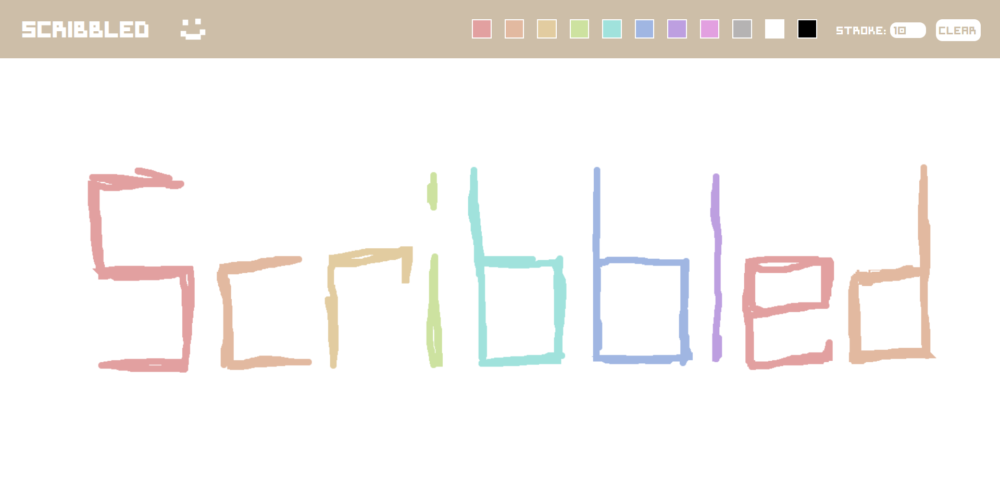

# scribbled

I made scribbled mostly because I wanted to learn about the canvas element so a lot of this project is just from the tutorials I followed which are linked down below.  

## Check out the Project

Check out the different aspects of the project below:

- [Heroku Deployment](https://sprite-planner.herokuapp.com/)
- [Repository](https://github.com/johnathanmann/scribbled)

## Resources 
[Build a Drawing App with HTML CSS & JavaScript](https://www.youtube.com/watch?v=h9Cpvss1An4&ab_channel=CodeCreative) 
[Drawing on canvas | React js](https://www.youtube.com/watch?v=Zq9aiwtEXF0&ab_channel=WebDevNinja) 
[React: how can I call a function when a component has loaded?](https://stackoverflow.com/questions/62774907/react-how-can-i-call-a-function-when-a-component-has-loaded/69985650#69985650) 
